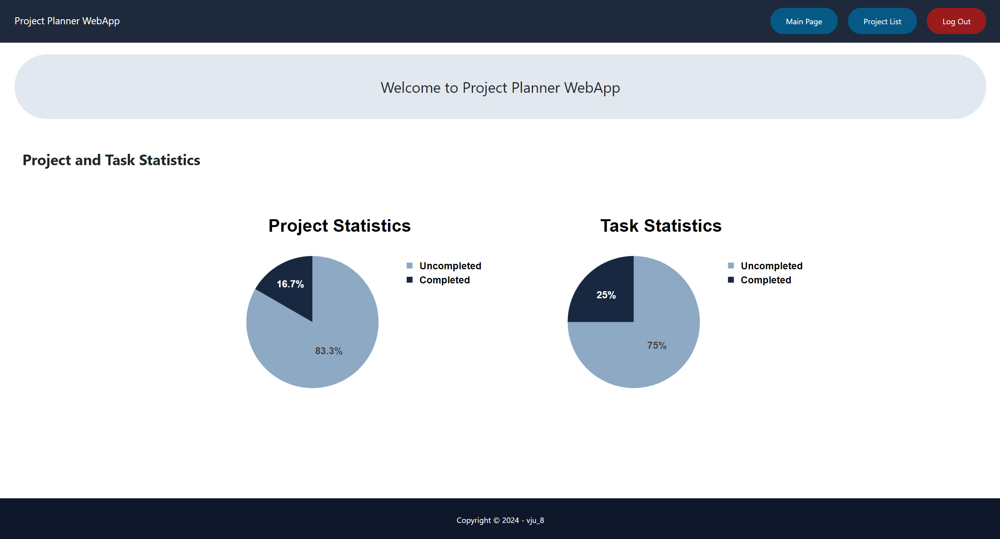
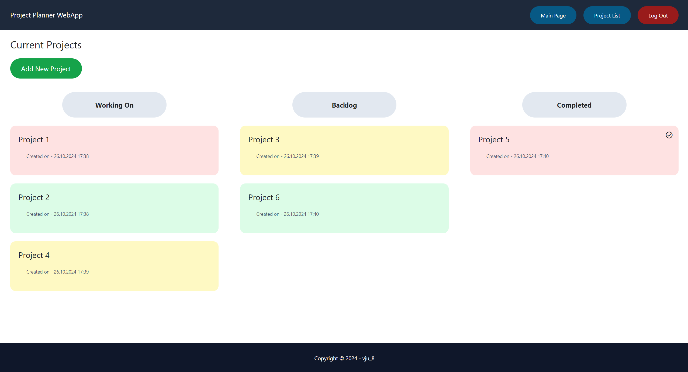
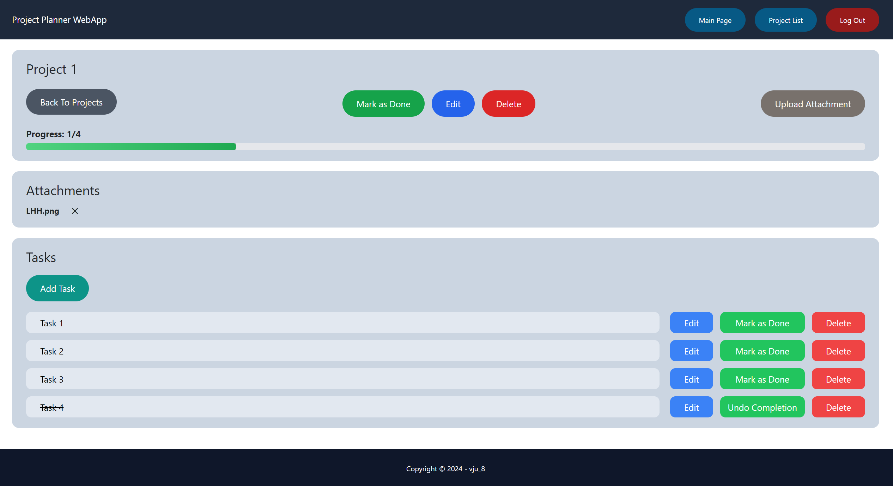

# MyProjectPlannerApp

MyProjectPlannerApp is a Django-based web application for project and task management. It provides a platform for users to create, organize, and track projects and their associated tasks.

## Table of Contents

1. [Project Overview](#project-overview)
2. [Features](#features)
3. [Technology Stack](#technology-stack)
4. [Project Structure](#project-structure)
5. [Setup and Installation](#setup-and-installation)
6. [Configuration](#configuration)
7. [Database](#database)
8. [Security](#security)


## Project Overview

MyProjectPlannerApp is designed to help individuals and teams manage their projects efficiently. It allows users to create projects, add tasks, set deadlines, and track progress. The application is built with Django, leveraging its powerful features for rapid development and scalability.

One of the key features is the ability to visualize projects in three distinct buckets:

1. **Working On**: Active projects currently in progress
2. **Backlog**: Projects planned for the future or on hold
3. **Completed**: Finished projects

This bucket system provides users with a clear overview of their project status and helps in prioritizing work effectively.

## Features

- User authentication and authorization
- Project creation and management
- Task creation and assignment within projects
- Project visualization in buckets: Working On, Backlog, and Completed
- File attachment support for tasks and projects
- User-friendly interface for easy navigation and management
- Session management for enhanced security

## Technology Stack

- **Backend Framework**: Django 5.1.1
- **Database**: SQLite (default Django database)
- **Configuration Management**: python-decouple
- **Static File Serving**: Django's built-in static file handling
- **Media File Handling**: Custom media root and URL configuration

## Project Structure

The project consists of several Django apps:

1. **core**: Main application handling core functionality
2. **account**: User account management
3. **project**: Project creation and management
4. **task**: Task creation, assignment, and tracking

## Setup and Installation

1. In CMD, navigate to wanted project location: 'cd file_location'
2. Clone the repository: `git clone https://github.com/vju8/Django_ProjectPlannerApp.git`
3. Navigate to project directory: `cd Django_ProjectPlannerApp`
4. Create a virtual environment: `python -m venv venv`
5. Activate the virtual environment:
   - Windows: `venv\Scripts\activate`
   - macOS/Linux: `source venv/bin/activate`
6. Install dependencies: `pip install -r requirements.txt`
7. Set up environment variables:
   - Create a `.env` file in the project root
   - Add the following lines to the `.env` file:
     ```
     SECRET_KEY=your_secret_key
     DEBUG=True
     ```
   - To generate a suitable SECRET_KEY, run:
     `python -c "from django.core.management.utils import get_random_secret_key; print(get_random_secret_key())"`
   - Copy the generated key and paste it as the value for SECRET_KEY in the `.env` file
8. Run database migrations: `python manage.py migrate`
9. Create a superuser (optional): `python manage.py createsuperuser`
10. Run the development server: `python manage.py runserver`
11. Access the application locally at http://127.0.0.1:8000 or http://localhost:8000

## Configuration
The project uses environment variables for configuration. Create a `.env` file in the project root with the following variables:

## Database
The project uses SQLite as the default database, which is included with Django. No additional database setup is required for local development.

## Security

- **Secret Key**: Stored as an environment variable
- **Debug Mode**: Controlled via environment variable (set to False in production)
- **Allowed Hosts**: Configured through environment variable
- **Password Validation**: Implements Django's built-in password validators
- **CSRF Protection**: Enabled by default
- **Session Management**:
  - Sessions expire after 10 minutes of inactivity
  - Sessions are invalidated when the browser is closed
  - Database-backed session storage

## Screenshots


*Overview of main page with simplified project and task statistics*


*Dashboard: Overview of all projects in different buckets*


*Dashboard: Overview of projects details with tasks, their status, and files*